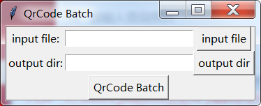

# Qrcode batch
批量生成二维码
# 需要的包 requirement package
> pip install qrcode
# 参考 ref
[qrcode](https://pypi.org/project/qrcode/)

[tkinter](https://www.runoob.com/python/python-gui-tkinter.html) 
# TODO
+ [x] 批量生成
+ [x]  basic ui
+ [] win桌面版
+ [] mac桌面版
# 更新 update
## 2019-8-27
basic ui done 
1.choose input file (.csv or .txt)
2.choose output directory
3.click button Qrcode Batch 
4.wait a second 

## 2019-8-26
完成基础功能，导入文件，批量生成二维码到指定文件